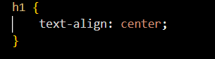
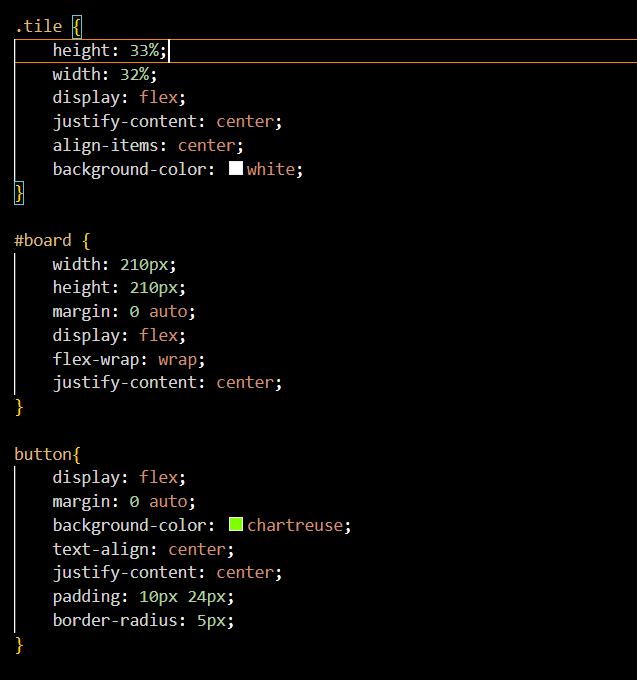

#Design System

This Document outlines the design system for CSI3140 Assignment 2 (TicTacToe Game)

##Fonts

-**Primary Font:** Times new roman is used for all text within our TicTacToe game

##Colour

-**Primary Colour:** White, RBG(255, 255, 255), is used as our primary background colour for the game

-**Secondary Colours:** Chartreuse, RGB(127, 255, 0), is used for our game RESET button. 
Red (#ff0000) and Blue (#0000ff) are used for the X and O tiles respectively, and Green (#08000)
is used to indicate winning tiles when a player wins.

##Components

###Header

###Custom Components

