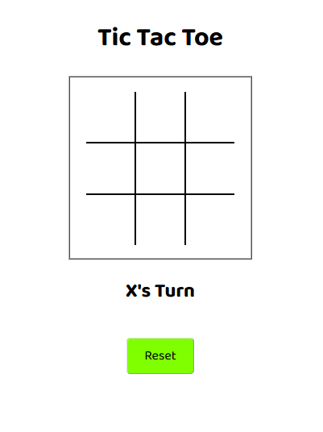
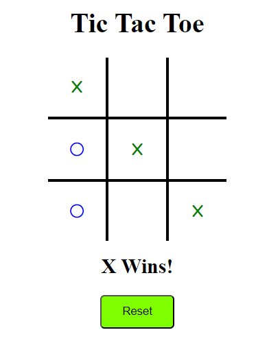

#Design System

This Document outlines the design system for CSI3140 Assignment 3 (TicTacToe Game)

##Fonts

-**Primary Font:** Baloo 2 is used for all text within our TicTacToe game.

##Colour

-**Primary Colour:** White, RBG(255, 255, 255), is used as our primary background colour for the game

-**Secondary Colours:** Chartreuse, RGB(127, 255, 0), is used for our game RESET button. 
Red (#ff0000) and Blue (#0000ff) are used for the X and O tiles respectively, and Green (#08000)
is used to indicate winning tiles when a player wins. Red and blue are also used for the scoreboard.

#AJAX Implementation

After the board is loaded, the server intializes the tiles and their states.
On clicking a box, the clickhandler sends a get request to the server to update the tile's state.
On receiving a response with whose turn it now is, the client updates the box, and then sends another
request to the server to check for a win or tie. If a win is received, the response contains the winning
line, and they are made green by the client. After a win or tie, the leaderboard is updated on the server side (stored in $_SESSION)
and returned to the client.

The reset button clears the board on the client side and sends a request to the server to reset the tile states.

#Project Structure

The index.php file contains the base html, and the server-side logic is contained in gamelogic.php
Client-side JS is in tictactoe.js, and css is kept in styles.css. Font Awesome icons are used to represent moves.

#Game States

